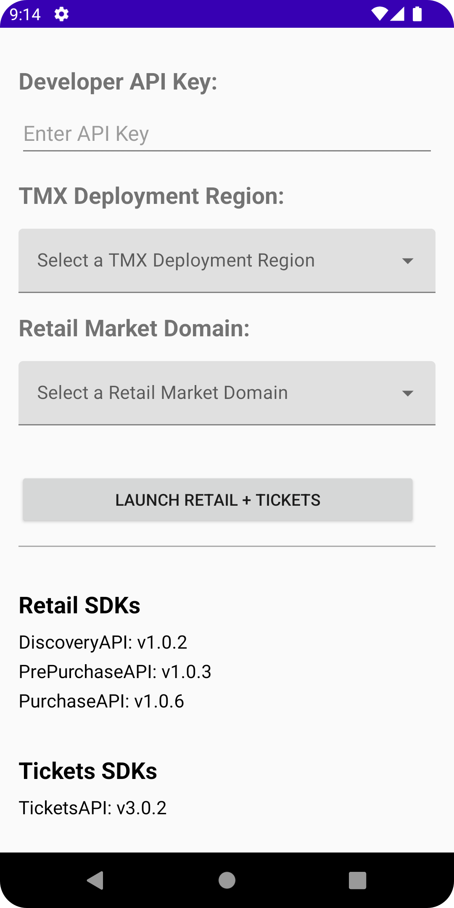
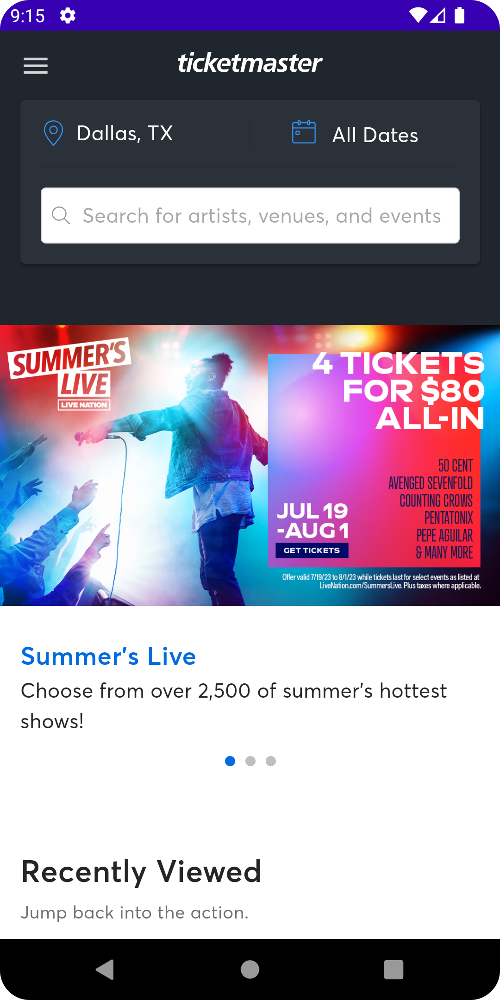
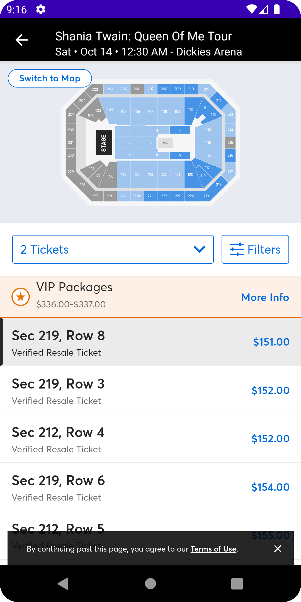
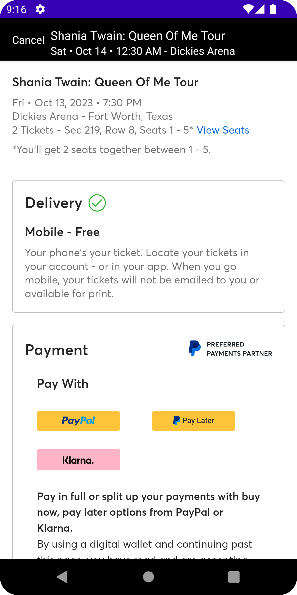

# Android-TicketmasterDemoIntegration
This is an example integration of the Ticketmaster RetailSDKs and TicketsSDKs.

* Overview: https://business.ticketmaster.com/ignite/
* RetailSDK Documentation: https://ignite.ticketmaster.com/docs/retail-sdk-overview
* TicketsSDK Documentation: https://ignite.ticketmaster.com/docs/tickets-sdk-overview

## Getting Started
1. Open `Android-TicketMasterRetailAndTicketsDemo` in Android Studio
   - This will also download all the required libraries
     
2. Get a developer API key: https://developer.ticketmaster.com/explore/
3. Build and Run

## Flow
The first flow you'll encounter after entering in your config items will be `PrePurchase`. 

`PrePurchase` is where you can search and discover tickets based on what you desire.
When you select a ticket, the `openEventDetailsPage` callback of PrePurchase's navigation listener, `TMPrePurchaseNavigationListener` is invoked and you'll have access to the necessary data to head to the `Purchase` section. 

`Purchase` consists of ticket selections and checkout.

Scenarios:

1. PrePurchase  ->               if (logged in)                  -> Purchase
2. PrePurchase  ->  if (not logged in) -> Tickets Authentication -> Purchase

## Demo App Screenshots

    
